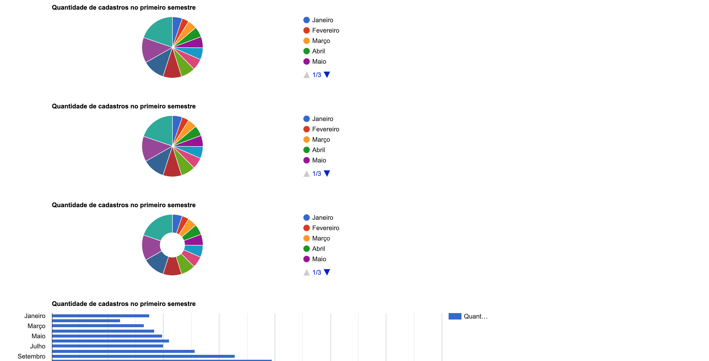

# Angular Google Charts 

A simple project using Angular and the Angular Google Charts library with the aim of studying the library's operation applying its main concepts and components.

# Running the project

